# ourbim-web-backstage

OurBIM是一款云原生架构的BIM数字孪生引擎平台，是集成BIM/GIS/CAD数据分析处理、可视化写实渲染、全类型终端交互、云端参数化设计、可视化仿真分析、接口二次开发的PaaS引擎平台。OurBIM不采用传统轻量化路线，保留原始数据，超级模型也能秒开，真正解放用户终端。
这是OurBIM官方自带前端的源代码，可直接下载复用，用于学习和二次开发场景。
## Project setup
```
npm install
```

### Compiles and hot-reloads for development
```
npm run serve
npm run dev
```

### Compiles and minifies for production
```
npm run build
```

### Lints and fixes files
```
npm run lint
```

[OurBIM云引擎](https://www.ourbim.com/)
<!--  -->

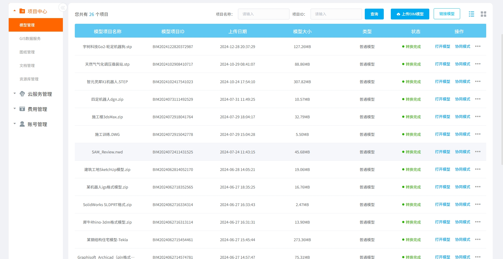
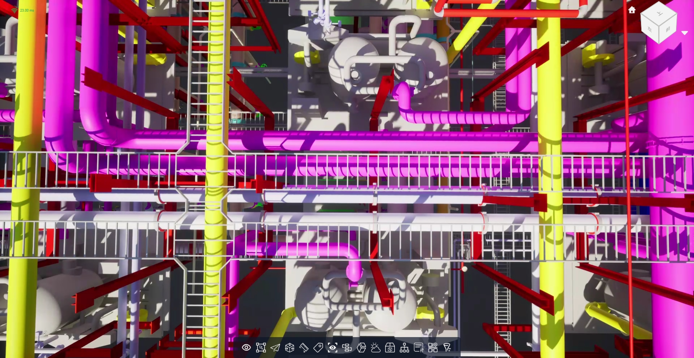
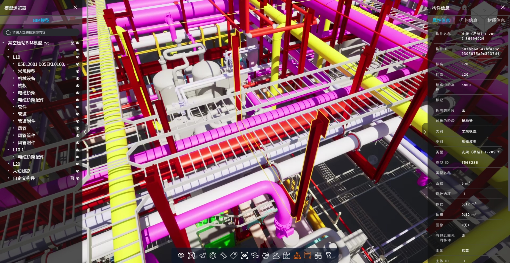
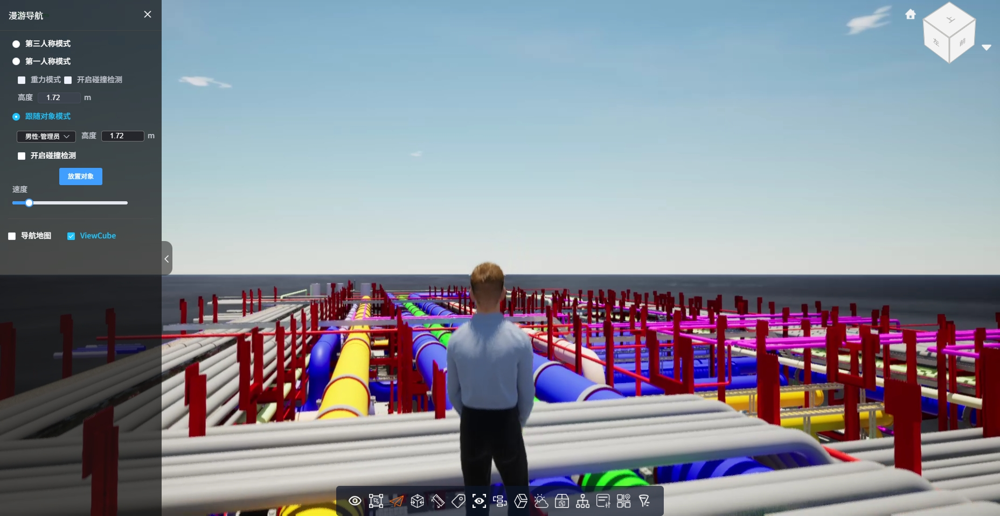
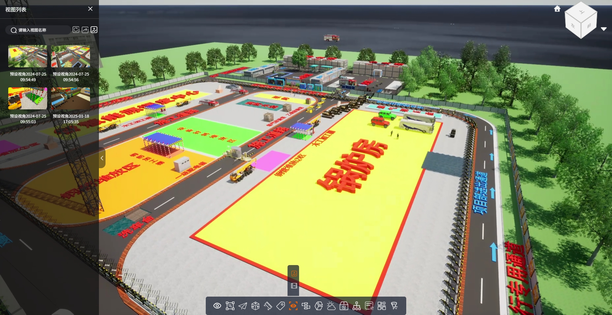
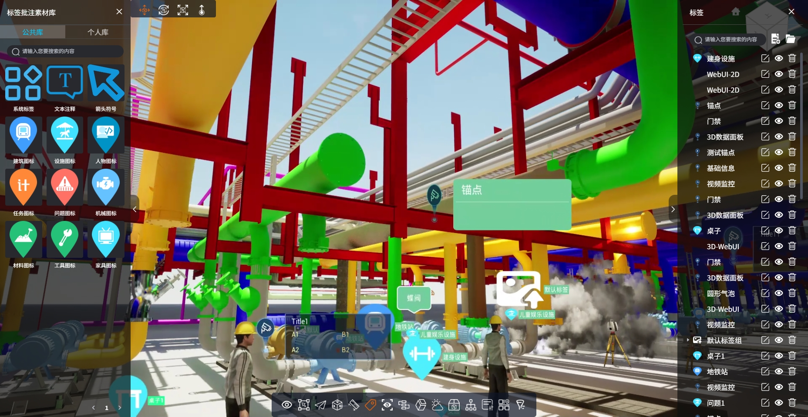
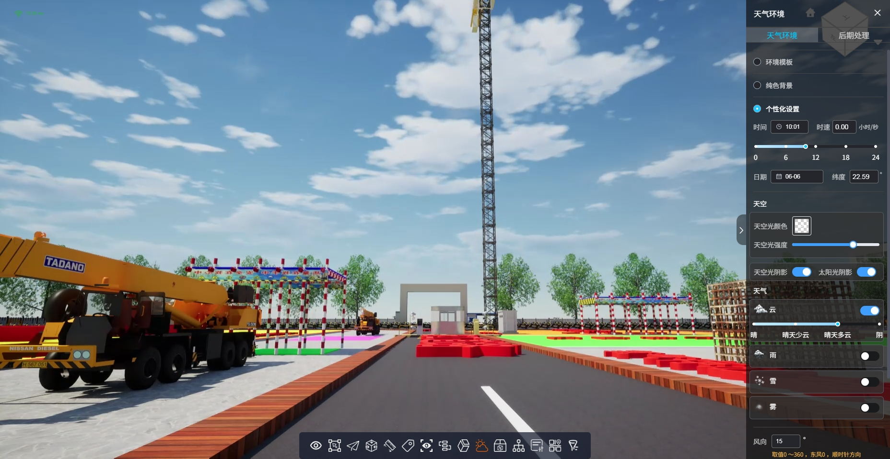
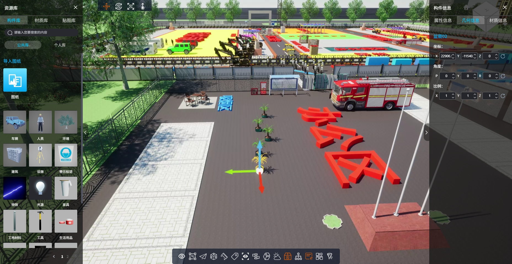
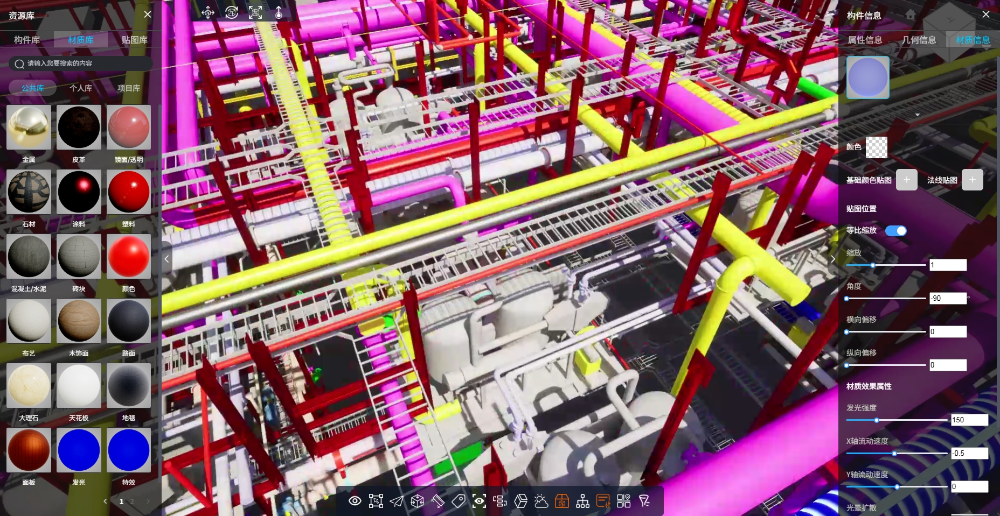
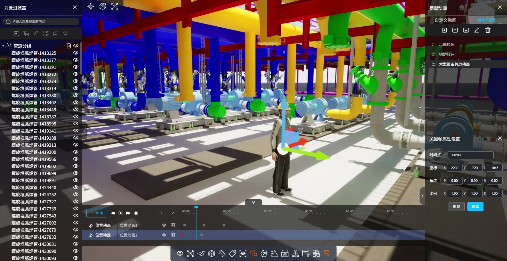
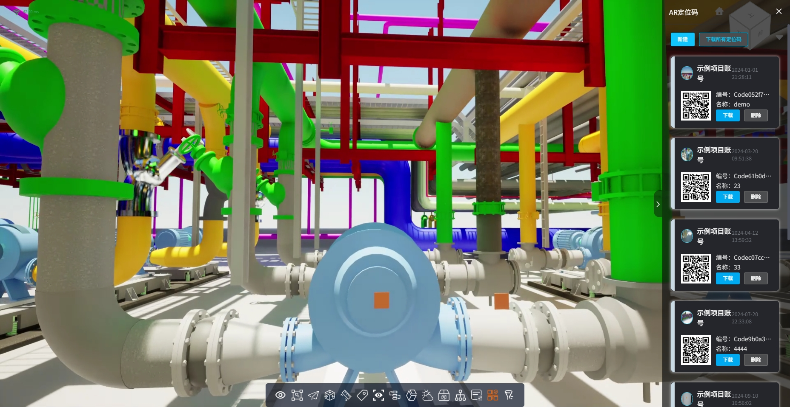
<!-- ### Customize configuration -->
<!-- See [Configuration Reference](https://cli.vuejs.org/config/). -->